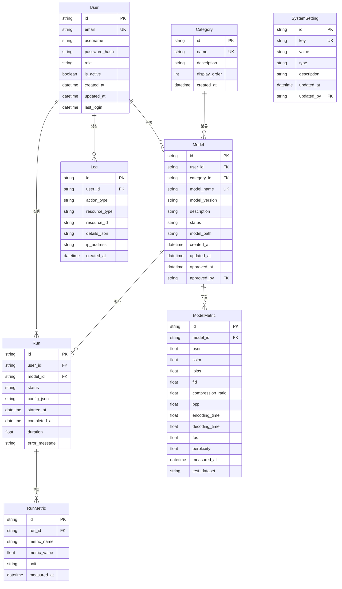

# Entity Relationship Diagram (ERD)
## Vision Arena - Vision Arena Leaderboard

**버전**: 1.0  
**작성일**: 2024

---

## 1. ERD 다이어그램

---

## 2. 엔티티 상세 설명

### 2.1 User (사용자)

**설명**: 시스템 사용자 정보를 저장하는 테이블

| 컬럼명 | 타입 | 제약조건 | 설명 |
|--------|------|----------|------|
| id | string | PK, UUID | 사용자 고유 식별자 |
| email | string | UK, NOT NULL | 이메일 주소 |
| username | string | NOT NULL | 사용자명 |
| password_hash | string | NOT NULL | 비밀번호 해시 |
| role | string | NOT NULL | 역할 (user, admin) |
| is_active | boolean | DEFAULT true | 활성화 여부 |
| created_at | datetime | NOT NULL | 생성 일시 |
| updated_at | datetime | NOT NULL | 수정 일시 |
| last_login | datetime | NULL | 마지막 로그인 일시 |

**인덱스**:
- `idx_user_email`: email
- `idx_user_role`: role

**관계**:
- `User` 1:N `Model` (등록)
- `User` 1:N `Run` (실행)
- `User` 1:N `Log` (생성)

---

### 2.2 Model (모델)

**설명**: VQGAN 모델 정보를 저장하는 테이블

| 컬럼명 | 타입 | 제약조건 | 설명 |
|--------|------|----------|------|
| id | string | PK, UUID | 모델 고유 식별자 |
| user_id | string | FK, NOT NULL | 등록 사용자 ID |
| category_id | string | FK, NULL | 카테고리 ID |
| model_name | string | UK, NOT NULL | 모델명 |
| model_version | string | NULL | 모델 버전 |
| description | text | NULL | 모델 설명 |
| status | string | NOT NULL | 상태 (pending, approved, rejected) |
| model_path | string | NULL | 모델 파일 경로 |
| created_at | datetime | NOT NULL | 생성 일시 |
| updated_at | datetime | NOT NULL | 수정 일시 |
| approved_at | datetime | NULL | 승인 일시 |
| approved_by | string | FK, NULL | 승인자 ID |

**인덱스**:
- `idx_model_user_id`: user_id
- `idx_model_category_id`: category_id
- `idx_model_status`: status
- `idx_model_name`: model_name

**관계**:
- `Model` N:1 `User` (등록자)
- `Model` N:1 `Category` (분류)
- `Model` 1:N `ModelMetric` (성능 지표)
- `Model` 1:N `Run` (평가)

**상태 값**:
- `pending`: 승인 대기
- `approved`: 승인됨
- `rejected`: 거부됨

---

### 2.3 ModelMetric (모델 성능 지표)

**설명**: 모델의 성능 지표를 저장하는 테이블

| 컬럼명 | 타입 | 제약조건 | 설명 |
|--------|------|----------|------|
| id | string | PK, UUID | 지표 고유 식별자 |
| model_id | string | FK, NOT NULL | 모델 ID |
| psnr | float | NULL | PSNR (dB) |
| ssim | float | NULL | SSIM (0-1) |
| lpips | float | NULL | LPIPS |
| fid | float | NULL | FID |
| compression_ratio | float | NULL | 압축률 |
| bpp | float | NULL | bits per pixel |
| encoding_time | float | NULL | 인코딩 시간 (ms) |
| decoding_time | float | NULL | 디코딩 시간 (ms) |
| fps | float | NULL | FPS |
| perplexity | float | NULL | Perplexity |
| measured_at | datetime | NOT NULL | 측정 일시 |
| test_dataset | string | NULL | 테스트 데이터셋 |

**인덱스**:
- `idx_model_metric_model_id`: model_id
- `idx_model_metric_measured_at`: measured_at

**관계**:
- `ModelMetric` N:1 `Model` (모델)

---

### 2.4 Category (카테고리)

**설명**: 모델 카테고리 정보를 저장하는 테이블

| 컬럼명 | 타입 | 제약조건 | 설명 |
|--------|------|----------|------|
| id | string | PK, UUID | 카테고리 고유 식별자 |
| name | string | UK, NOT NULL | 카테고리명 |
| description | text | NULL | 카테고리 설명 |
| display_order | int | NOT NULL | 표시 순서 |
| created_at | datetime | NOT NULL | 생성 일시 |

**인덱스**:
- `idx_category_name`: name
- `idx_category_display_order`: display_order

**관계**:
- `Category` 1:N `Model` (분류)

---

### 2.5 Run (평가 실행)

**설명**: 모델 평가 실행 정보를 저장하는 테이블

| 컬럼명 | 타입 | 제약조건 | 설명 |
|--------|------|----------|------|
| id | string | PK, UUID | 실행 고유 식별자 |
| user_id | string | FK, NOT NULL | 실행 사용자 ID |
| model_id | string | FK, NOT NULL | 평가 모델 ID |
| status | string | NOT NULL | 상태 (pending, running, completed, failed) |
| config_json | json | NULL | 실행 설정 (JSON) |
| started_at | datetime | NULL | 시작 일시 |
| completed_at | datetime | NULL | 완료 일시 |
| duration | float | NULL | 실행 시간 (초) |
| error_message | text | NULL | 에러 메시지 |

**인덱스**:
- `idx_run_user_id`: user_id
- `idx_run_model_id`: model_id
- `idx_run_status`: status
- `idx_run_started_at`: started_at

**관계**:
- `Run` N:1 `User` (실행자)
- `Run` N:1 `Model` (평가 모델)
- `Run` 1:N `RunMetric` (평가 지표)

**상태 값**:
- `pending`: 대기 중
- `running`: 실행 중
- `completed`: 완료
- `failed`: 실패

---

### 2.6 RunMetric (실행 지표)

**설명**: 평가 실행 결과 지표를 저장하는 테이블

| 컬럼명 | 타입 | 제약조건 | 설명 |
|--------|------|----------|------|
| id | string | PK, UUID | 지표 고유 식별자 |
| run_id | string | FK, NOT NULL | 실행 ID |
| metric_name | string | NOT NULL | 지표명 |
| metric_value | float | NOT NULL | 지표 값 |
| unit | string | NULL | 단위 |
| measured_at | datetime | NOT NULL | 측정 일시 |

**인덱스**:
- `idx_run_metric_run_id`: run_id
- `idx_run_metric_name`: metric_name

**관계**:
- `RunMetric` N:1 `Run` (실행)

---

### 2.7 Log (시스템 로그)

**설명**: 시스템 활동 로그를 저장하는 테이블

| 컬럼명 | 타입 | 제약조건 | 설명 |
|--------|------|----------|------|
| id | string | PK, UUID | 로그 고유 식별자 |
| user_id | string | FK, NULL | 사용자 ID |
| action_type | string | NOT NULL | 액션 타입 |
| resource_type | string | NULL | 리소스 타입 |
| resource_id | string | NULL | 리소스 ID |
| details_json | json | NULL | 상세 정보 (JSON) |
| ip_address | string | NULL | IP 주소 |
| created_at | datetime | NOT NULL | 생성 일시 |

**인덱스**:
- `idx_log_user_id`: user_id
- `idx_log_action_type`: action_type
- `idx_log_created_at`: created_at
- `idx_log_resource`: resource_type, resource_id

**관계**:
- `Log` N:1 `User` (생성자)

**액션 타입**:
- `model_create`: 모델 생성
- `model_update`: 모델 수정
- `model_delete`: 모델 삭제
- `model_approve`: 모델 승인
- `run_create`: 평가 실행 생성
- `run_complete`: 평가 실행 완료
- `user_login`: 사용자 로그인
- `user_logout`: 사용자 로그아웃
- `setting_update`: 설정 변경

---

### 2.8 SystemSetting (시스템 설정)

**설명**: 시스템 설정 값을 저장하는 테이블

| 컬럼명 | 타입 | 제약조건 | 설명 |
|--------|------|----------|------|
| id | string | PK, UUID | 설정 고유 식별자 |
| key | string | UK, NOT NULL | 설정 키 |
| value | string | NOT NULL | 설정 값 |
| type | string | NOT NULL | 값 타입 (string, number, boolean, json) |
| description | text | NULL | 설정 설명 |
| updated_at | datetime | NOT NULL | 수정 일시 |
| updated_by | string | FK, NULL | 수정자 ID |

**인덱스**:
- `idx_system_setting_key`: key

**관계**:
- `SystemSetting` N:1 `User` (수정자)

**주요 설정 키**:
- `performance_weight_quality`: 화질 가중치
- `performance_weight_compression`: 압축 가중치
- `performance_weight_speed`: 속도 가중치
- `evaluation_timeout`: 평가 타임아웃 (초)
- `max_models_per_user`: 사용자당 최대 모델 수

---

## 3. 관계 설명

### 3.1 User - Model 관계
- **관계**: 1:N (One-to-Many)
- **설명**: 한 사용자는 여러 모델을 등록할 수 있음
- **외래키**: `Model.user_id` → `User.id`

### 3.2 User - Run 관계
- **관계**: 1:N (One-to-Many)
- **설명**: 한 사용자는 여러 평가를 실행할 수 있음
- **외래키**: `Run.user_id` → `User.id`

### 3.3 Model - ModelMetric 관계
- **관계**: 1:N (One-to-Many)
- **설명**: 한 모델은 여러 성능 지표를 가질 수 있음 (버전별, 데이터셋별)
- **외래키**: `ModelMetric.model_id` → `Model.id`

### 3.4 Model - Run 관계
- **관계**: 1:N (One-to-Many)
- **설명**: 한 모델은 여러 평가 실행을 가질 수 있음
- **외래키**: `Run.model_id` → `Model.id`

### 3.5 Category - Model 관계
- **관계**: 1:N (One-to-Many)
- **설명**: 한 카테고리는 여러 모델을 포함할 수 있음
- **외래키**: `Model.category_id` → `Category.id`

### 3.6 Run - RunMetric 관계
- **관계**: 1:N (One-to-Many)
- **설명**: 한 평가 실행은 여러 지표를 생성할 수 있음
- **외래키**: `RunMetric.run_id` → `Run.id`

---

## 4. 데이터 무결성 규칙

### 4.1 참조 무결성
- 모든 외래키는 부모 테이블의 기본키를 참조해야 함
- 부모 레코드 삭제 시 자식 레코드 처리 정책:
  - `Model` 삭제 시: `ModelMetric`, `Run`은 CASCADE 또는 SET NULL
  - `User` 삭제 시: `Model`, `Run`, `Log`는 CASCADE 또는 SET NULL
  - `Run` 삭제 시: `RunMetric`는 CASCADE

### 4.2 도메인 무결성
- `status` 필드는 정의된 값만 허용
- `role` 필드는 'user', 'admin'만 허용
- `type` 필드는 정의된 타입만 허용

### 4.3 엔티티 무결성
- 모든 기본키는 NOT NULL, UNIQUE
- 모든 UK(Unique Key)는 UNIQUE 제약조건

---

## 5. 인덱스 전략

### 5.1 기본 인덱스
- 모든 기본키에 자동 인덱스 생성
- 모든 외래키에 인덱스 생성

### 5.2 성능 최적화 인덱스
- 자주 조회되는 컬럼에 인덱스 생성
- 정렬 및 필터링에 사용되는 컬럼에 인덱스 생성
- 복합 인덱스: `(resource_type, resource_id)`, `(user_id, created_at)`

---

## 6. 향후 확장 계획

### 6.1 추가 엔티티
- **Dataset**: 테스트 데이터셋 정보
- **Benchmark**: 벤치마크 정보
- **Comment**: 모델 댓글
- **Favorite**: 즐겨찾기

### 6.2 관계 확장
- 모델 버전 관리
- 모델 비교 히스토리
- 사용자 그룹 및 권한

---

## 7. 데이터베이스 선택 가이드

### 7.1 추천 데이터베이스
- **PostgreSQL**: 관계형 데이터베이스 (추천)
- **MySQL**: 대안 관계형 데이터베이스
- **MongoDB**: 문서 기반 데이터베이스 (유연성 필요 시)

### 7.2 선택 기준
- 관계형 데이터 구조 → PostgreSQL
- 높은 트랜잭션 처리 → PostgreSQL
- 빠른 개발 및 프로토타이핑 → MongoDB

---

## 8. 마이그레이션 전략

### 8.1 현재 상태
- 로컬 스토리지 기반 데이터 저장
- 메모리 기반 기본 모델 데이터

### 8.2 마이그레이션 계획
1. 데이터베이스 스키마 생성
2. 기본 데이터 마이그레이션
3. 로컬 스토리지 데이터 마이그레이션
4. API 연동 및 데이터 동기화

---

## 9. 참고사항

- 현재는 프론트엔드 중심 구조로, 실제 데이터베이스 연동은 향후 구현 예정
- ERD는 향후 백엔드 개발 시 참고용으로 작성됨
- 실제 구현 시 데이터베이스 특성에 맞게 조정 필요

