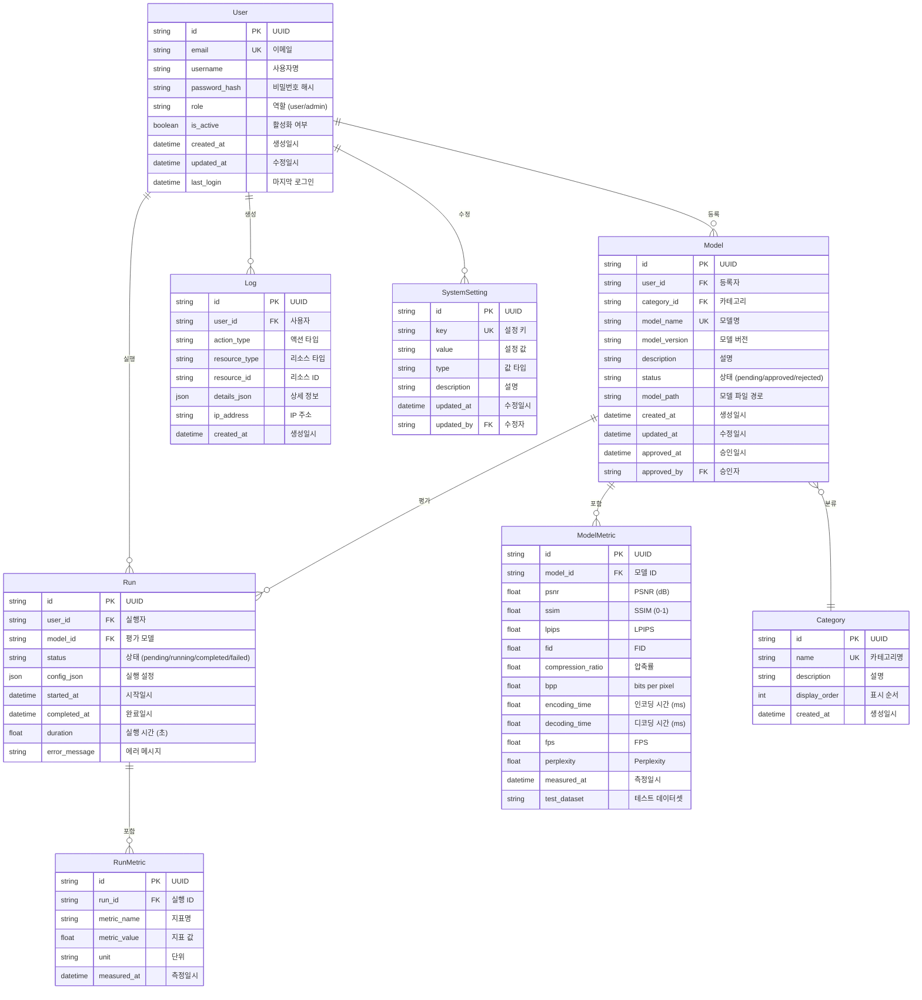
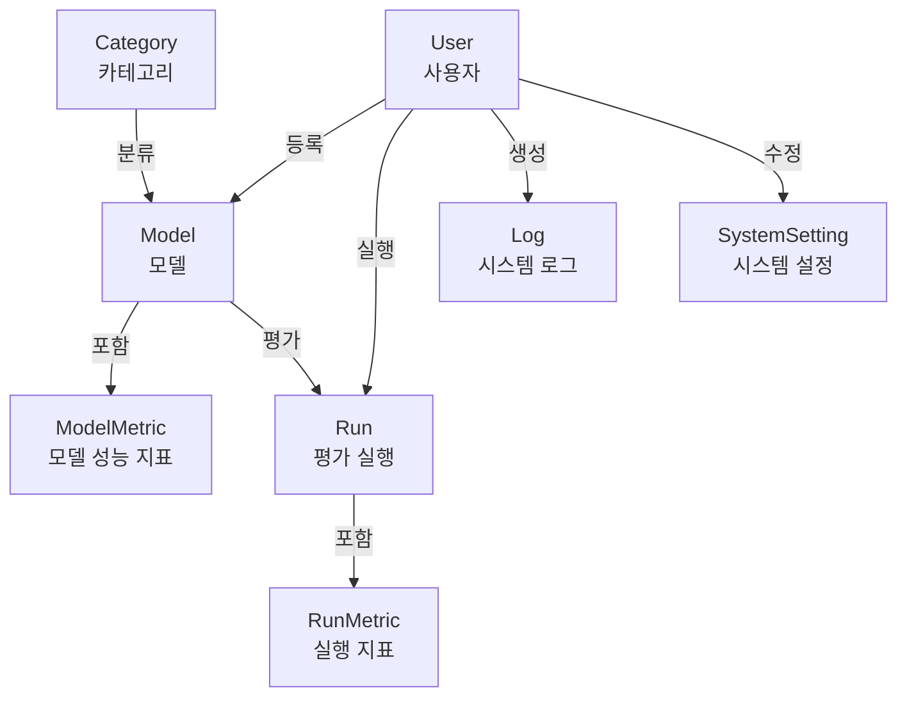
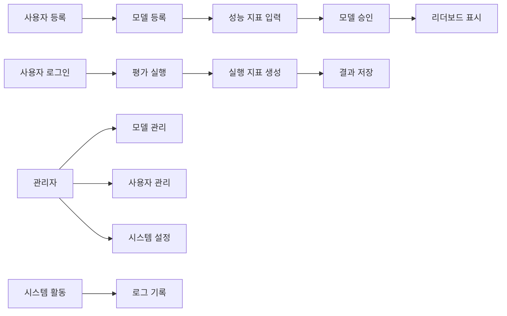

# ERD 시각화 다이어그램

## 1. 전체 ERD 다이어그램



## 2. 핵심 엔티티 관계도



## 3. 데이터 흐름도



## 4. 주요 관계 상세

### 4.1 User - Model 관계
```
User (1) ──────< 등록 >────── (N) Model
```
- 한 사용자는 여러 모델을 등록할 수 있음
- 모델은 반드시 한 사용자에 속함

### 4.2 Model - ModelMetric 관계
```
Model (1) ──────< 포함 >────── (N) ModelMetric
```
- 한 모델은 여러 성능 지표를 가질 수 있음
- 버전별, 데이터셋별로 다른 지표 저장 가능

### 4.3 Model - Run 관계
```
Model (1) ──────< 평가 >────── (N) Run
```
- 한 모델은 여러 평가 실행을 가질 수 있음
- 평가 실행은 반드시 한 모델에 속함

### 4.4 Run - RunMetric 관계
```
Run (1) ──────< 포함 >────── (N) RunMetric
```
- 한 평가 실행은 여러 지표를 생성할 수 있음
- 실행 결과 지표 저장

## 5. 엔티티 카디널리티

| 관계 | 카디널리티 | 설명 |
|------|-----------|------|
| User - Model | 1:N | 한 사용자당 여러 모델 |
| User - Run | 1:N | 한 사용자당 여러 평가 실행 |
| User - Log | 1:N | 한 사용자당 여러 로그 |
| Model - ModelMetric | 1:N | 한 모델당 여러 성능 지표 |
| Model - Run | 1:N | 한 모델당 여러 평가 실행 |
| Category - Model | 1:N | 한 카테고리당 여러 모델 |
| Run - RunMetric | 1:N | 한 실행당 여러 지표 |

## 6. 샘플 데이터 예시

### User
```json
{
  "id": "user-001",
  "email": "researcher@example.com",
  "username": "researcher",
  "role": "user",
  "is_active": true,
  "created_at": "2024-01-01T00:00:00Z"
}
```

### Model
```json
{
  "id": "model-001",
  "user_id": "user-001",
  "category_id": "cat-001",
  "model_name": "VQGAN-256",
  "status": "approved",
  "created_at": "2024-01-02T00:00:00Z"
}
```

### ModelMetric
```json
{
  "id": "metric-001",
  "model_id": "model-001",
  "psnr": 32.5,
  "ssim": 0.92,
  "lpips": 0.08,
  "compression_ratio": 12.5,
  "fps": 25,
  "measured_at": "2024-01-02T10:00:00Z"
}
```


